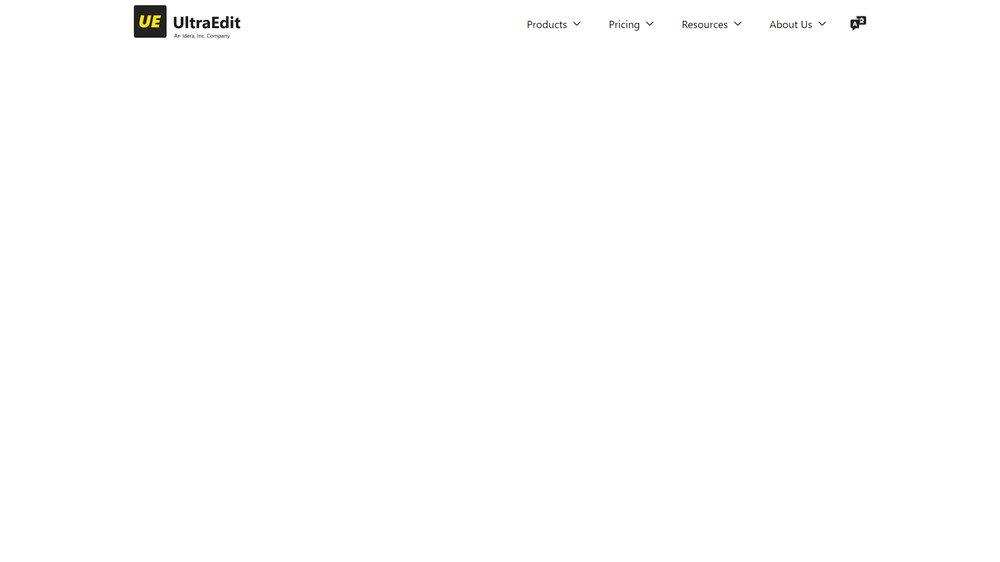

# UltraEdit Website Navigation Bar

## Description
This project provides a responsive navigation bar for the UltraEdit website. It's designed to be easily integrated into your project with minimal setup.

## Features
- Responsive design that works on desktop and mobile devices.
- Dropdown menus for organizing content.
- Customizable logo and navigation items.

## Usage
To use this navigation bar in your project, include the `style.css` file in your project and add the HTML snippet from the `index.html` file to your page.

## Dependencies
- The navigation bar uses the 'Segoe UI' font, which may need to be included in your project if not already available.
- SVG icons are used for dropdown indicators.

## Customization
You can customize the navigation bar by editing the `style.css` file. Change the colors, fonts, and spacing to match your project's design.

## Screenshot

## License
This project is licensed under the MIT License - see the LICENSE file for details.

## Acknowledgments
- Thanks to the UltraEdit team for the inspiration.
- SVG icons provided by SVG Repo.